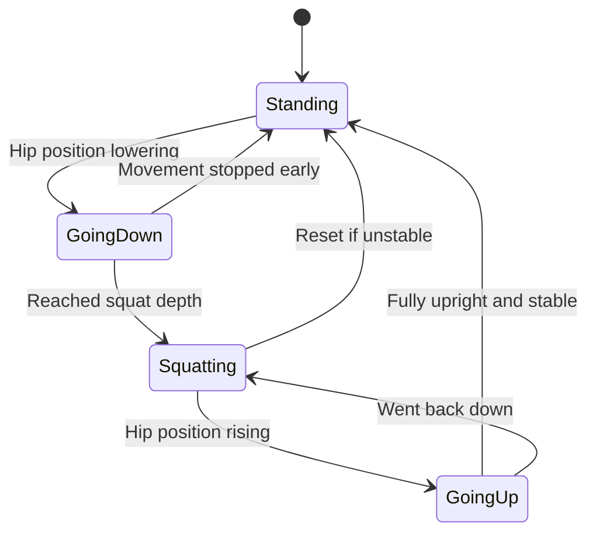

# Squat Check

## How It Works

The squat detection system uses your device's camera and machine learning to track your movements in real-time. Here's how it works:

1. **Setup**

   - Accesses your camera
   - Loads the TensorFlow.js pose detection model
   - Creates a video feed with skeleton overlay

2. **Body Tracking**

   - Tracks 8 key body points: shoulders, hips, knees, and ankles
   - Draws a skeleton overlay to show tracking accuracy
   - Ensures all key points are visible before starting

3. **Squat Detection States**

   - Standing: Starting position, waiting for downward movement
   - Going Down: Detected beginning of squat movement
   - Squatting: Reached proper squat depth
   - Going Up: Returning to standing position

4. **Measurement Method**

   - Calculates the distance between hips and knees
   - Compares hip position relative to knees and ankles
   - Requires stable position for several frames to prevent false counts
   - Uses 15% of leg length as minimum squat depth

5. **Feedback System**
   - Provides real-time text guidance
   - Shows squat count
   - Plays audio cue when squat begins
   - Displays "GOOD!" message on successful squats

The core detection logic can be found in the analyzePose function:

## State Machine Flow

### State Transitions

1. **Standing** (Initial State)

   - User is in upright position
   - Waiting for downward movement
   - Transitions to "Going Down" when hips start lowering

2. **Going Down**

   - Monitoring downward movement
   - Must reach proper squat depth
   - Can return to "Standing" if movement stops early

3. **Squatting**

   - Proper squat depth achieved
   - Waiting for upward movement
   - Must maintain stable position
   - Can reset to "Standing" if position becomes unstable

4. **Going Up**
   - Monitoring upward movement
   - Must reach full standing position
   - Can return to "Squatting" if user goes back down
   - Counts as complete rep when reaching stable standing position

### Success Criteria

- Must complete full range of motion
- Requires stability at bottom position
- Needs stable standing position to count rep
- Minimum depth must be achieved (15% of leg length)
